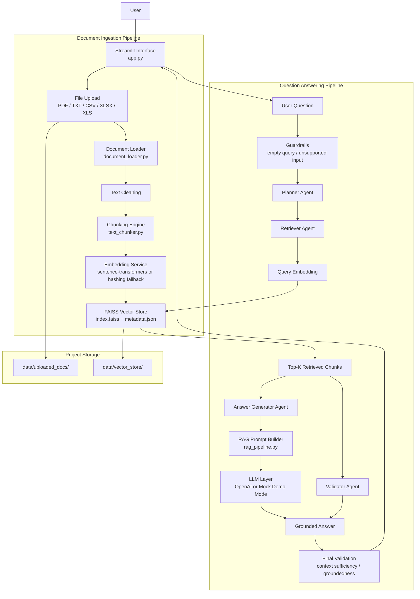

# Architecture Diagram

## Diagram Notes

- The ingestion pipeline converts uploaded enterprise documents into searchable chunks.
- The vector store keeps both embeddings and chunk metadata for retrieval.
- The agent layer separates planning, retrieval, answer generation, and validation.
- Guardrails run before and after generation to keep answers document-grounded.
