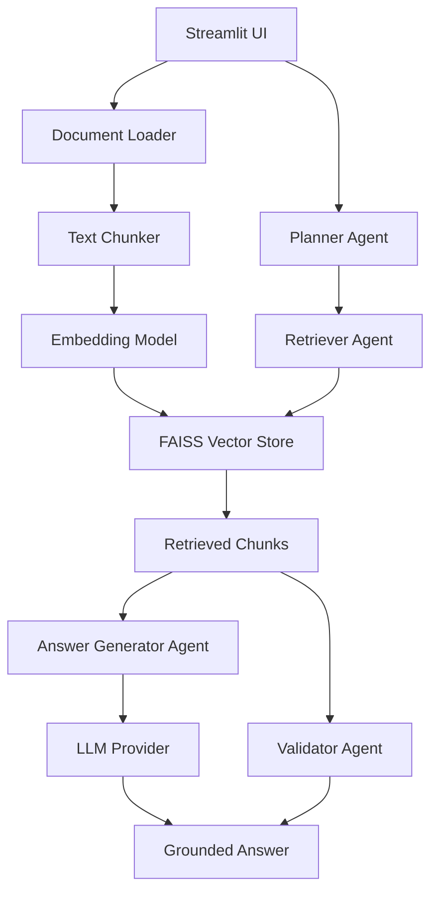

# Architecture Diagram

```mermaid
flowchart TD
    A["Streamlit UI"] --> B["Document Loader"]
    B --> C["Text Chunker"]
    C --> D["Embedding Model"]
    D --> E["FAISS Vector Store"]
    A --> F["Planner Agent"]
    F --> G["Retriever Agent"]
    G --> E
    E --> H["Retrieved Chunks"]
    H --> I["Answer Generator Agent"]
    I --> J["LLM Provider"]
    H --> K["Validator Agent"]
    J --> L["Grounded Answer"]
    K --> L
```

